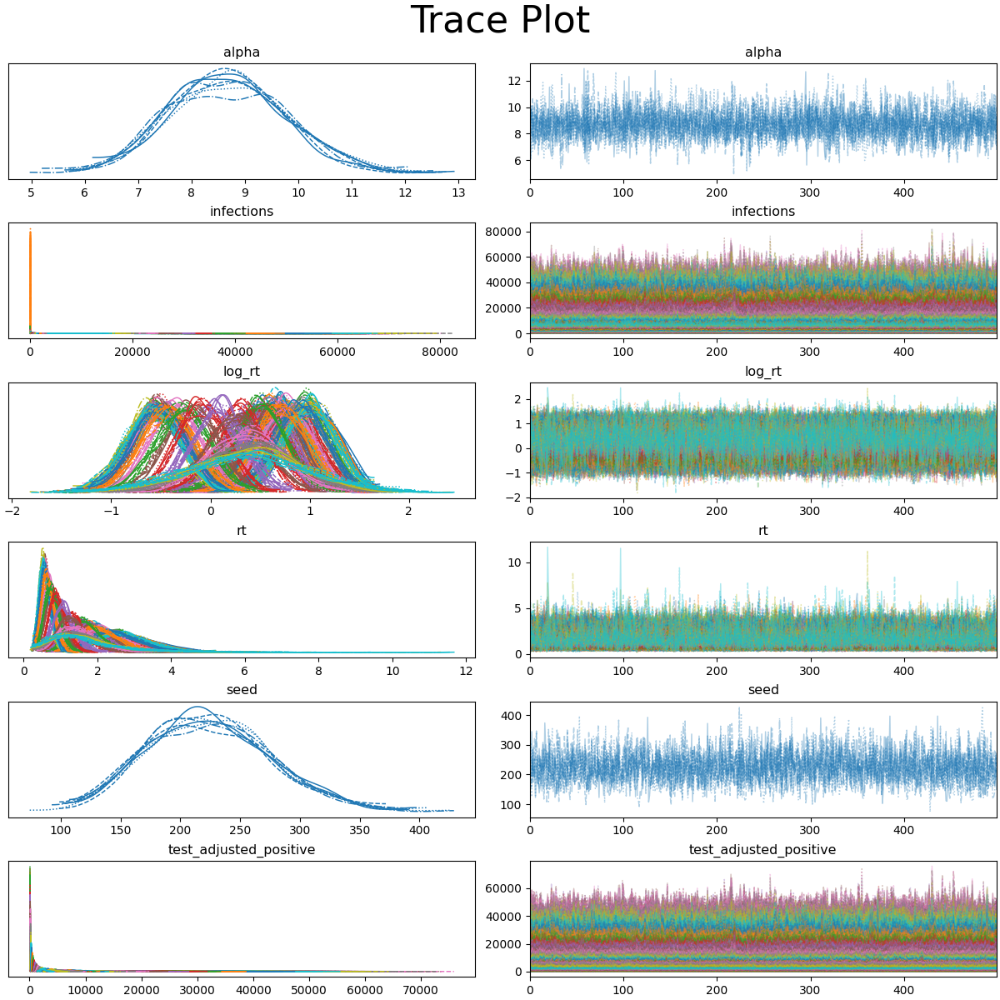

# Covid Bayesian Analysis

This project uses Bayesian methods and probabilistic programming to analyze the COVID-19 pandemic. It estimates effective reproduction rate and daily new cases for Hong Kong. The data is obtained from [DATA.GOV.HK](https://data.gov.hk/en-data/dataset/hk-dh-chpsebcddr-novel-infectious-agent).

The main idea is based on rtlive and k-sys/covid-19 by Thomas Wiecki and Kevin Systrom. The model is a State Space Model with Gaussian random walk prior, implemented in PyMC.

A few plots are generated to visualize the results. Note that time series plots are mostly in aspect ratio 21:9 for better visualization.[\[1\]](http://vis.stanford.edu/files/2006-Banking-InfoVis.pdf)[\[2\]](http://vis.stanford.edu/files/2012-SlopeComparison-InfoVis.pdf)

## References

### Implementations and Tutorials

- [rtlive](https://rt.live/)
  - uses State Space Model with Gaussian random walk prior
  - [Youtube@The Bayesian Workflow: Building a COVID-19 Model by Thomas Wiecki](https://discourse.pymc.io/t/the-bayesian-workflow-building-a-covid-19-model-by-thomas-wiecki/6017/1)
  - [generative-rtlive.ipynb  -- Thomas Wiecki](https://gist.github.com/twiecki/fc63488e7c81d162af3f58ae68a32cd4)
  - [rtcovidlive/covid-model/generative.py -- Thomas Wiecki](https://github.com/rtcovidlive/covid-model/blob/master/covid/models/generative.py)
  - [rtcovidlive/rtlive-global/Tutorial_model.ipynb -- Kevin Systrom](https://github.com/rtcovidlive/rtlive-global/blob/master/notebooks/Tutorial_model.ipynb)
- k-sys/covid-19 -- Kevin Systrom, founder of Instagram
  - [k-sys/covid-19/Realtime R0.ipynb -- Kevin Systrom](https://github.com/k-sys/covid-19/blob/master/Realtime%20R0.ipynb)
    - no probabilistic library, uses max-likelihood estimation
    - uses Gaussian Processes
    - alternatives:
      - [farr/covid-19/Stan R0.ipynb -- Will M. Farr](https://github.com/farr/covid-19/blob/master/Stan%20R0.ipynb)
        - based on `k-sys/covid-19/Realtime R0.ipynb`, but using Bayesian posterior
        - similar to `k-sys/covid-19/Realtime Rt mcmc.ipynb`, but estimating $R_t$ of confirmation instead.
      - [discussion on github issue: binomial distribution instead of a Poisson](https://github.com/k-sys/covid-19/issues/45)
      - [discussion on github issue: smoothing](https://github.com/k-sys/covid-19/issues/30)
  - [k-sys/covid-19/Realtime Rt mcmc.ipynb -- Kevin Systrom](https://github.com/k-sys/covid-19/blob/master/Realtime%20Rt%20mcmc.ipynb)
    - Ideas
      - attempt to account for delays between infection, onset, and confirmation
      - Translate Confirmation Dates to Onset Dates
      - Adjust for Right-Censoring
    - Implemented Gaussian random walk prior model and Gaussian process prior model
    - Sample the Posterior with PyMC3
    - inspired by Thomas Vladdeck's work
    - helped by Thomas Wiecki
- [tvladeck/covid-rt -- Thomas P. Vladeck](https://github.com/tvladeck/covid-rt)
  - uses State Space Model
  - implemented in Stan
  - [Blog: Using State Space Models to Estimate Rt -- Thomas P. Vladeck](https://tomvladeck.com/2020/04/15/rt-ssm.html)
    - background on this is `k-sys/covid-19/Realtime R0.ipynb`
    - update: [Extending the State Space Approach with Mixed Effects](https://tomvladeck.com/2020/04/16/rt-mixed-effect-ssm.html)
- [luisroque/bayesian_time_series | Forecasting new COVID19 cases in Portugal using Gaussian Processes.ipynb](https://github.com/luisroque/bayesian_time_series/blob/main/Forecasting%20new%20COVID19%20cases%20in%20Portugal%20using%20Gaussian%20Processes.ipynb)
  - uses Gaussian Processes
- [Blog: Reflections on two years estimating effective reproduction numbers](https://epiforecasts.io/posts/2022-03-25-rt-reflections/)
- [twiecki/covid19 bunch of ipynb -- Thomas Wiecki](https://github.com/twiecki/covid19)
- Compartmental model
  - [dsheldon/covid -- Bayesian SEIRD model](https://github.com/dsheldon/covid?tab=readme-ov-file)
  - [Youtube@SIR model -- Thomas Wiecki](https://www.youtube.com/watch?v=C1kWBTj6KvE&list=PLCPDoJ_cdViyhqkB-zm-JeOVeKANXb1-m&index=5)
  - [Priesemann-Group implementations](https://discourse.pymc.io/t/covid-19-case-numbers-inference-support-welcomed-funding-available/4922)
    - uses SIR/SEIR models
    - [Priesemann-Group/covid19_inference](https://github.com/Priesemann-Group/covid19_inference/)
    - [Priesemann-Group/covid19_inference_forecast](https://github.com/Priesemann-Group/covid19_inference_forecast)
    - Research Article published in Science: [Inferring change points in the spread of COVID-19 reveals the effectiveness of interventions](https://www.science.org/doi/10.1126/science.abb9789)
    - Talk: [Inferring the spread of SARS-CoV-2 --- and measures to mitigate it (Viola Priesemann)](https://www.youtube.com/watch?v=btHkSlePV5Q)
  - [Discussion: SIR ODE model with Sunode](https://discourse.pymc.io/t/sir-ode-model-with-sunode/12368)
- [tensorflow/probability/Estimating_COVID_19_in_11_European_countries.ipynb](https://github.com/tensorflow/probability/blob/main/tensorflow_probability/examples/jupyter_notebooks/Estimating_COVID_19_in_11_European_countries.ipynb)
  - fine tuned bijectors to solve problem of heaviness of tails of lognormal distribution and make inference fast and numerically more stable
- [broadinstitute/pyro-cov | Pyro models for SARS-CoV-2 analysis](https://github.com/broadinstitute/pyro-cov)
  - implemented in Pyro
  - Research Article published in Science: [Analysis of 6.4 million SARS-CoV-2 genomes identifies mutations associated with fitness](https://www.science.org/doi/10.1126/science.abm1208)
- [epidemics/COVIDNPIs](https://github.com/epidemics/COVIDNPIs/tree/manuscript?tab=readme-ov-file)
  - [Research Article published in Science: Inferring the effectiveness of government interventions against COVID-19](https://www.science.org/doi/10.1126/science.abd9338)
- [Causal inference on excess deaths due to COVID-19](https://www.pymc.io/projects/examples/en/latest/causal_inference/excess_deaths.html)
  - it is a tutorial on causal inference based on Google's CausalImpact using PyMC3
